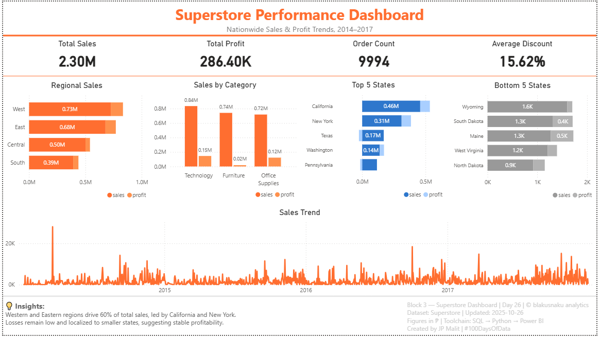

# 🏪 blakusnaku — Superstore Sales Analytics (BI Capstone)


---



## 📊 Overview
The **Superstore Sales Analytics Project** is an end-to-end Business Intelligence (BI) capstone built under the **blakusnaku analytics** brand.  
It demonstrates the full analytics lifecycle — from **data cleaning** and **SQL validation** to **Python verification** and **Power BI storytelling** — with a focus on real-world business impact.

> 🧭 Goal: Transform raw sales transactions into actionable insights for regional strategy, product profitability, and discount optimization.

---

## 🔁 Pipeline Flow

| Step | Tool | Output |
|------|------|---------|
| 1️⃣ | Excel | Data cleaning & formatting (`superstore_clean_stage1.csv`) |
| 2️⃣ | SQL (SQLite) | Schema creation and integrity validation (`superstore.db`) |
| 3️⃣ | Python (pandas) | Profiling and data type validation (`superstore_clean_final.csv`) |
| 4️⃣ | Power BI | Dashboard design and business insight visualization (`superstore_dashboard_v1.pbix`) |
| 5️⃣ | GitHub | Documentation and portfolio publication (`README.md`, logs, visuals) |

---

## 💡 Business Pains & Analytical Goals

| Business Pain | Analytical Solution |
|----------------|----------------------|
| Declining profitability despite steady sales | Identified high discount regions and low-margin categories |
| Lack of clarity in regional sales trends | Segmented performance by Region, State, and Category |
| Need to understand discount behavior impact | Correlated discount rates with profit variance |
| Inconsistent reporting across departments | Delivered unified Power BI dashboard with standardized KPIs |

---

## 🧠 Key Insights

| Category | Insight |
|-----------|----------|
| **Regional Performance** | Western and Eastern regions generate over 60 % of sales |
| **Category Profitability** | Technology yields highest margins; Furniture drags overall profit |
| **Discount Behavior** | High discounts drive negative profits — requires margin control |
| **Top vs Bottom States** | California, New York, and Washington lead; Maine and Wyoming underperform |

---

## 📊 Dashboard Overview

| Visual | Purpose |
|---------|----------|
| **KPI Cards (Top Section)** | Total Sales • Profit • Quantity • Avg Discount |
| **Sales by Region (Bar Chart)** | Regional contribution to overall performance |
| **Category Profit Comparison (Clustered Bar)** | Identify which categories drive or lose profit |
| **Top 5 & Bottom 5 States** | Pinpoint best/worst performers by profit |
| **Yearly Sales Trend Line** | Temporal anchor for business growth analysis |

---

## 🎨 Design Standards

| Element | Specification |
|----------|----------------|
| **Color Palette** | blakusnaku Orange Gradient (#FF914D → #FFF2E9) |
| **Font** | Segoe UI / Poppins |
| **Layout Ratio** | Title 15 %  |  Visuals 70 %  |  Footer 15 % |
| **Footer Layout** | Left: Insights paragraph  •  Right: Metadata block |
| **Footer Fields** | Block 3 — Superstore Dashboard | Day 26 | © blakusnaku analytics |

---

## 🧩 Repository Structure
```
blakusnaku-superstore-sales-analytics/
├── assets/
│ └── superstore_dashboard_v1.png 
│
├── dashboard/
│ └── superstore_dashboard_v1.pbix
│
├── data/
│ └── superstore_clean_final.csv
│
├── notes/
│ ├── data_cleaning_log.md
│ ├── sql_schema_log.md
│ ├── python_sql_validation_log.md
│ ├── day26_dashboard_log.md
│ └── day27_reflection.md
│
└── README.md
```

---

## 🗂️ Documentation Links

| File | Description |
|------|--------------|
| [`data_cleaning_log.md`](notes/data_cleaning_log.md) | Excel cleaning and formatting steps |
| [`sql_schema_log.md`](notes/sql_schema_log.md) | Schema setup and SQL integrity validation |
| [`python_sql_validation_log.md`](notes/python_sql_validation_log.md) | Python data validation and profiling |
| [`day26_dashboard_log.md`](notes/day26_dashboard_log.md) | Power BI design and layout documentation |
| [`day27_reflection.md`](notes/day27_reflection.md) | Final reflection and BI Mastery summary |

---

## 🧾 Business Impact
This dashboard helps business teams to:
- Focus resources on **high-margin categories and profitable regions**.  
- Detect **loss-making discounts** and adjust pricing strategies.  
- Identify **growth opportunities** in underperforming states.  
- Maintain **data consistency and reporting transparency** across departments.

---

## 🪞 Brand Identity
**blakusnaku analytics** emphasizes craftsmanship in data — where insight, design, and clarity meet.  
This project embodies that ethos by turning raw data into a cohesive business narrative.

---

## 📌 References
- Dataset Source: *Sample Superstore Dataset (Tableau / Kaggle)*  
- Tools: Excel • SQLite • Python (pandas) • Power BI • GitHub  

---

### 🔗 Related Projects
- 🧮 [blakusnaku-100-days-of-data](https://github.com/JP-Malit/blakusnaku-100-days-of-data) — Full learning timeline  
- 🏘️ *Upcoming:* [blakusnaku-str-analytics](https://github.com/JP-Malit/blakusnaku-str-analytics) — Short-Term Rental Analysis & Automation  

---

**Created by JP Malit | #100DaysOfData | © blakusnaku analytics**
